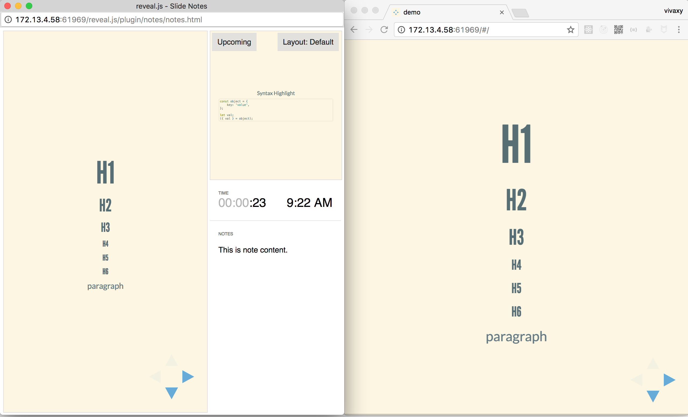

# node-reveal


🎁 A reveal.js cli

[![NPM Version][npm-version-image]][npm-url]
[![NPM Downloads][npm-downloads-image]][npm-url]
[![MIT License][license-image]][license-url]
[![Standard Version][standard-version-image]][standard-version-url]



## Feature

Based on [reveal.js](https://github.com/hakimel/reveal.js#markdown).

- Easy to setup. No cloning repositories. No template files.
- Markdown files as slides content.
- Sync sliding between clients.
- Auto reload when markdown file changes.
- Speaker view.
- Theme config.
- Inline html.
- Support Node.js >= v8.

## Notable Markdown Syntax

- Use `\r?\n----\r?\n` as horizontal slides separator.
- Use `\r?\n---\r?\n` as vertical slides separator.
- Use `^Note:` as speaker notes separator.
- Use `<!-- .slide: data-background="#ff0000" -->` to customize slide styles.
- Use `<!-- .element: style="width: 60%;" -->` to customize element styles.
- Use `<!-- .element: class="fragment" -->` to create fragment.

## Basic Usage

### Npx

`npx @vivaxy/reveal server --markdown /path/to/presentation.md`

### Keyboard Shortcuts

- `Space`: Next
- `Up`, `Down`, `Left`, `Right`: Navigation
- `k`, `j`, `h`, `l`: Navigation
- `f`: Full-screen
- `s`: Show slide notes
- `o`: Toggle overview
- `.` (`Period`, `b`, `v` or `/`): Turn screen black
- `Esc`: Escape from full-screen, or toggle overview
- `alt + left click`: Toggle zoom
- `p`, `n`: Previous and next

## Advanced Usage

### Commands

#### `start`

##### Basic Usage

```sh
reveal server \
    --markdown ./ppt/reveal.md \
    --theme solarized \
    --highlight-theme solarized-light \
    --transition slide \
    --port 8080 \
    --watch \
    --separator '^\r?\n----\r?\n$' \
    --separator-vertical '^\r?\n---\r?\n$' \
    --separator-notes '^Note:'
    --width 1440
    --height 900
    --log-level 2
    --script 'custom.js'
```

##### Options

| Name                   | Type          | Required | Default                               | Description                                                                  |
| ---------------------- | ------------- | -------- | ------------------------------------- | ---------------------------------------------------------------------------- |
| `--markdown`           | string        | ✔        | N/A                                   | markdown file                                                                |
| `--theme`              | string        | ✖        | `solarized`                           | [`reveal.js` theme](https://github.com/hakimel/reveal.js#theming)            |
| `--highlight-theme`    | string        | ✖        | `solarized-light`                     | [`highlight.js` theme](https://highlightjs.org/static/demo/)                 |
| `--transition`         | string        | ✖        | `slide`                               | [`reveal.js` slide type](https://github.com/hakimel/reveal.js#configuration) |
| `--port`               | number        | ✖        | `0`                                   | server port                                                                  |
| `--watch`              | boolean       | ✖        | `false`                               | reload when markdown changed                                                 |
| `--separator`          | string        | ✖        | `^\r?\n----\r?\n$`                    | horizontal slides separator                                                  |
| `--separator-vertical` | string        | ✖        | `^\r?\n---\r?\n$`                     | vertical slides separator                                                    |
| `--separator-notes`    | string        | ✖        | `^Note:`                              | speaker notes separator                                                      |
| `--width`              | number        | ✖        | 1440                                  | slide width                                                                  |
| `--height`             | number        | ✖        | 900                                   | slide height                                                                 |
| `--log-level`          | number/string | ✖        | `2`                                   | [log output level](https://github.com/vivaxy/log-util#log-level)             |
| `--script`             | string        | ✖        | `` | insert custom script before head |

### URL Parameters

#### `print-pdf`

Used to print as pdf files.

Add `?print-pdf&showNotes=true`, like: `http://127.0.0.1:3000/?print-pdf#/`.

Press `Ctrl/Command + p` to open print dialog.

Usually, `print-pdf` is used with `showNotes`, like `http://127.0.0.1:3000/?print-pdf&showNotes=separate-page#/`

#### `showNotes`

Show speakers notes.

Add `?showNotes=true`, like: `http://127.0.0.1:3000/?showNotes=true#/`.

## Support

node >= v7.10

## Change Log

See [CHANGELOG.md](CHANGELOG.md).

## Prior Art

- [ksky521/nodePPT](https://github.com/ksky521/nodePPT)
- [hiroppy/fusuma](https://github.com/hiroppy/fusuma)
- [hakimel/reveal.js](https://github.com/hakimel/reveal.js)
- [webpro/reveal-md](https://github.com/webpro/reveal-md)
- [int64ago/node-reveal](https://github.com/int64ago/node-reveal)

[npm-version-image]: http://img.shields.io/npm/v/@vivaxy/reveal.svg?style=flat-square
[npm-url]: https://www.npmjs.com/package/@vivaxy/reveal
[npm-downloads-image]: https://img.shields.io/npm/dt/@vivaxy/reveal.svg?style=flat-square
[license-image]: https://img.shields.io/npm/l/@vivaxy/reveal.svg?style=flat-square
[license-url]: LICENSE
[standard-version-image]: https://img.shields.io/badge/release-standard%20version-brightgreen.svg?style=flat-square
[standard-version-url]: https://github.com/conventional-changelog/standard-version
